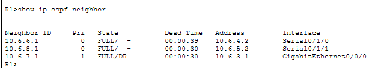
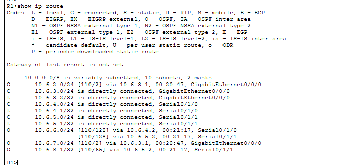
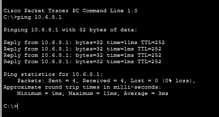

# packet-tracer-enterprise-network
Cisco Packet Tracer network project featuring routers, switches, wireless devices, IP addressing, OSPF routing, multilayer switching, and end-to-end connectivity testing.

# Cisco Packet Tracer Enterprise Network

This project demonstrates the design and configuration of a small enterprise network using Cisco Packet Tracer.

## Project Overview

The network includes routers, switches, wireless devices, end-user systems, and a server. The network was configured to provide communication between multiple devices and network segments.

## Network Topology

## Network Design

The network is divided into multiple routed segments that communicate using OSPF.

### R1
R1 connects three routed networks:

- `10.6.3.0/24`
- `10.6.4.0/24`
- `10.6.5.0/24`

It participates in OSPF Area 0 and provides routing between the multilayer switch and the other routers.

### R2
R2 connects:

- `10.6.5.0/24`
- `10.6.6.0/24`
- Loopback network `10.6.8.0/24`

The loopback interface is also advertised through OSPF.

### R3
R3 connects:

- `10.6.4.0/24`
- `10.6.6.0/24`

It provides another routing path between R1 and R2 through OSPF.

### Multilayer Switch
The multilayer switch provides Layer 3 routing between:

- `10.6.2.0/24`
- `10.6.3.0/24`
- `10.6.7.0/24`

`ip routing` is enabled so the switch can route traffic between networks. Routed ports are used to connect the switch to the wireless router and R1.

### Wireless Router
The wireless router connects the local wireless and wired LAN to the routed network.

- WAN IP: `10.6.2.2/24`
- Default gateway: `10.6.2.1`
- LAN IP: `10.6.1.1/24`
- Main SSID: `Tech170Group6`
- 2.4 GHz channel: 6

The wireless router provides connectivity for devices on the `10.6.1.0/24` LAN.

## Technologies and Concepts

- Cisco Packet Tracer
- IPv4 addressing
- Static IP configuration
- Cisco IOS CLI
- OSPF routing
- Multilayer switching
- Wireless access points
- Wireless LAN controller
- Connectivity testing
- ICMP / Ping

## Network Components

The topology includes:

- Cisco routers
- Cisco 2960 switches
- Multilayer switch
- Wireless access point
- Wireless LAN controller
- Server
- PCs and laptops

## Configuration

Devices were assigned IP addresses and configured through the Cisco IOS command-line interface.

OSPF was used to allow routers to dynamically exchange routing information.

A multilayer switch was configured to provide Layer 3 routing capabilities within the network.

## Testing

Connectivity was verified using ICMP ping tests between network devices and end systems.

Successful communication confirmed that routing and addressing were configured correctly.

## Verification

### OSPF Neighbors
The following output shows R1 successfully forming OSPF adjacencies with neighboring routers and the multilayer switch.

### Routing Table
R1's routing table shows directly connected networks and routes learned dynamically through OSPF.

### End-to-End Connectivity

#### Ping to R2 Loopback
A device on the `10.6.1.0/24` LAN successfully pinged the R2 loopback interface at `10.6.8.1`, confirming connectivity across the routed network.

#### Ping to Remote LAN
A device on the `10.6.1.0/24` LAN successfully pinged the remote host at `10.6.7.10`, confirming end-to-end communication between different subnets.

## Skills Demonstrated

- Network design
- Router and switch configuration
- Troubleshooting
- IP addressing
- Dynamic routing
- Wireless networking
- Cisco IOS
